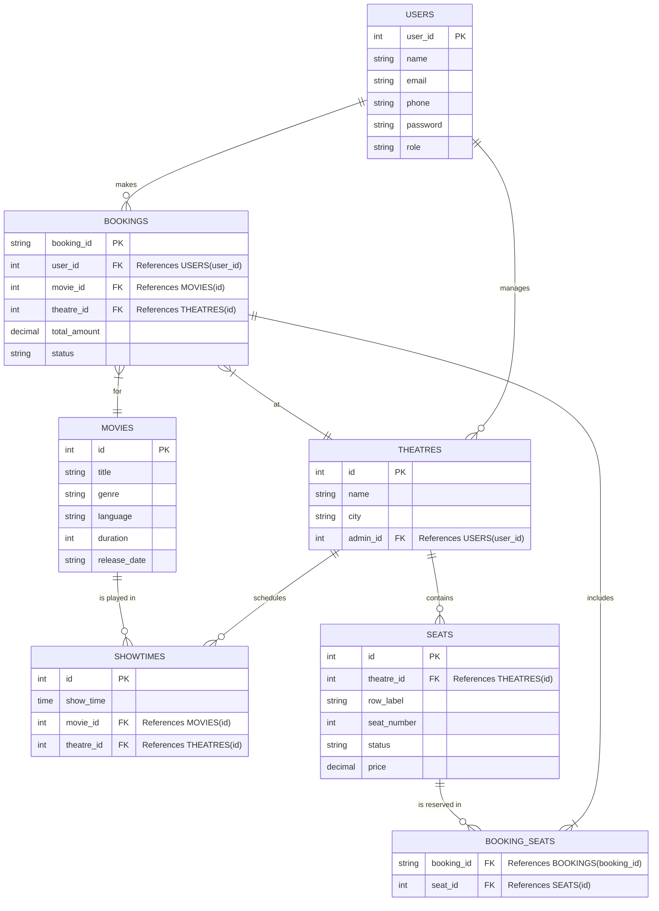

# Database Schema & ER Diagram

This document outlines the relational database schema and Entity-Relationship (ER) diagram for the Ticket Booking System, based on the application's domain models.

## ER Diagram

## Table Structures

### 1. `users` Table
Stores all user information, including role-based access control.

| Column Name | Data Type    | Constraints                  | Description |
|-------------|--------------|------------------------------|-------------|
| `user_id`   | INT          | PRIMARY KEY, AUTO_INCREMENT  | Unique ID for user |
| `name`      | VARCHAR(100) | NOT NULL                     | Full name of the user |
| `email`     | VARCHAR(100) | UNIQUE, NOT NULL             | Email address |
| `phone`     | VARCHAR(15)  |                              | Contact number |
| `password`  | VARCHAR(255) | NOT NULL                     | Encrypted password |
| `role`      | VARCHAR(50)  | NOT NULL                     | Role (e.g., Super Admin, Theatre Admin, Customer) |

### 2. `movies` Table
Stores information about movies.

| Column Name    | Data Type    | Constraints                 | Description |
|----------------|--------------|-----------------------------|-------------|
| `id`           | INT          | PRIMARY KEY, AUTO_INCREMENT | Unique ID for movie |
| `title`        | VARCHAR(255) | NOT NULL                    | Movie title |
| `genre`        | VARCHAR(100) |                             | Movie genre (e.g., Action, Comedy) |
| `language`     | VARCHAR(50)  |                             | Language (e.g., Tamil, English) |
| `duration`     | INT          |                             | Runtime in minutes |
| `release_date` | VARCHAR(25)  |                             | Release date |

### 3. `theatres` Table
Stores theatre details and linking to its assigned Theatre Admin.

| Column Name | Data Type    | Constraints                 | Description |
|-------------|--------------|-----------------------------|-------------|
| `id`        | INT          | PRIMARY KEY, AUTO_INCREMENT | Unique ID for theatre |
| `name`      | VARCHAR(255) | NOT NULL                    | Name of the theatre |
| `city`      | VARCHAR(100) | NOT NULL                    | City location |
| `admin_id`  | INT          | FOREIGN KEY (users.user_id) | Admin managing this theatre |

### 4. `showtimes` Table
Schedules representing which movie is playing at which theatre at what time.

| Column Name  | Data Type | Constraints                  | Description |
|--------------|-----------|------------------------------|-------------|
| `id`         | INT       | PRIMARY KEY, AUTO_INCREMENT  | Unique ID for showtime |
| `show_time`  | TIME      | NOT NULL                     | Time of the show |
| `movie_id`   | INT       | FOREIGN KEY (movies.id)      | The movie playing |
| `theatre_id` | INT       | FOREIGN KEY (theatres.id)    | The theatre hosting the show |

### 5. `seats` Table
Represents physical seats in a theatre.

| Column Name  | Data Type    | Constraints                  | Description |
|--------------|--------------|------------------------------|-------------|
| `id`         | INT          | PRIMARY KEY, AUTO_INCREMENT  | Unique ID for seat |
| `theatre_id` | INT          | FOREIGN KEY (theatres.id)    | Theatre this seat belongs to |
| `row_label`  | VARCHAR(5)   | NOT NULL                     | Row label (e.g., A, B) |
| `seat_number`| INT          | NOT NULL                     | Number in the row |
| `status`     | VARCHAR(20)  | DEFAULT 'AVAILABLE'          | Current status (AVAILABLE, BOOKED) |
| `price`      | DECIMAL(10,2)| NOT NULL                     | Base price for the seat |

### 6. `bookings` Table
Stores overall ticket booking transactions.

| Column Name    | Data Type    | Constraints                  | Description |
|----------------|--------------|------------------------------|-------------|
| `booking_id`   | VARCHAR(50)  | PRIMARY KEY                  | Unique string ID for the booking |
| `user_id`      | INT          | FOREIGN KEY (users.user_id)  | User who made the booking |
| `movie_id`     | INT          | FOREIGN KEY (movies.id)      | Movie selected |
| `theatre_id`   | INT          | FOREIGN KEY (theatres.id)    | Theatre selected |
| `total_amount` | DECIMAL(10,2)| NOT NULL                     | Total paid for the booking |
| `status`       | VARCHAR(20)  | DEFAULT 'PENDING'            | Booking status (CONFIRMED, CANCELLED) |

### 7. `booking_seats` Table (Join Table)
Associates a booking with the specific seats mapped to it.

| Column Name   | Data Type   | Constraints                           | Description |
|---------------|-------------|---------------------------------------|-------------|
| `booking_id`  | VARCHAR(50) | FOREIGN KEY (bookings.booking_id)     | Reference to the booking |
| `seat_id`     | INT         | FOREIGN KEY (seats.id)                | Reference to the specific seat |

*(Note: Since `seatLabels` is currently implemented as a list of strings in the Java code, normalizing it into a `booking_seats` database structure allows standard and robust relational mapping for SQL databases.)*
